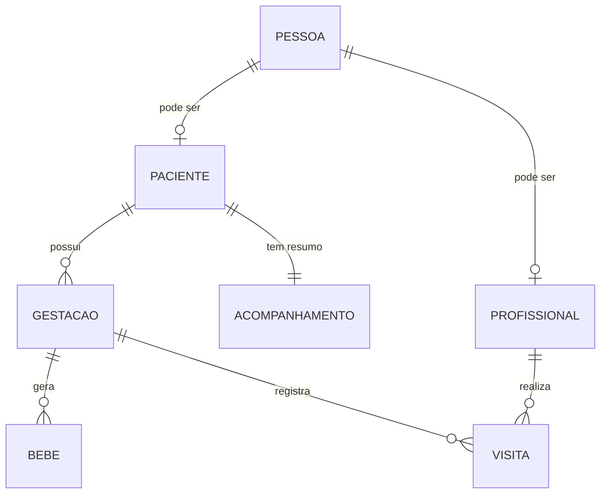

# Modelo de Domínio — Equipe Cegonha

O modelo de domínio reflete a estrutura relacional do sistema, centrada na Pessoa e suas especializações (Paciente e Profissional).

## 1. Entidades Principais

### 1.1. Pessoa
A entidade base para qualquer usuário ou indivíduo no sistema.
- **Campos:** `id`, `nome`, `cpf`, `dataNascimento`, `sexo`, `estadoCivil`, `nacionalidade`, `tipoPessoa` (Boolean: Profissional/Paciente).
- **Relacionamentos:**
  - 1:1 com `Paciente` (opcional).
  - 1:1 com `Profissional` (opcional).

### 1.2. Paciente
Especialização de Pessoa que recebe o acompanhamento.
- **Campos:** `id`, `tipoSanguineo`, `alergias`, `hasResponsavel`, `nomeResponsavel`, `telefoneResponsavel`.
- **Relacionamentos:**
  - 1:1 com `Pessoa`.
  - 1:N com `Gestacao`.
  - 1:1 com `Acompanhamento`.

### 1.3. Profissional
Especialização de Pessoa que realiza o atendimento (ACS).
- **Campos:** `id`, `matricula`, `cargo`, `equipe`, `areaCobertura`.
- **Relacionamentos:**
  - 1:1 com `Pessoa`.
  - 1:N com `Visita` (via `Visita.profissional`).

### 1.4. Gestacao
Ciclo de acompanhamento da gestante.
- **Campos:** `id`, `dataUltimaMenstruacao`, `dataProvavelParto`, `dataParto`, `tipoParto`, `idadeGestacional`, `status` (Ativa/Finalizada).
- **Relacionamentos:**
  - N:1 com `Paciente`.
  - 1:N com `Bebe`.
  - 1:N com `Visita`.

### 1.5. Bebe (Recém-Nascido)
Registro dos filhos vinculados a uma gestação.
- **Campos:** `id`, `nome`, `dataNascimento`, `sexo`, `tipoParto`.
- **Relacionamentos:**
  - N:1 com `Gestacao`.

### 1.6. Acompanhamento (Indicadores)
Resumo consolidado do estado do paciente.
- **Campos:** `nivelRisco`, `quantidadeVisitasRealizadas`, `quantidadeConsultasRealizadas`, `observacoes`.
- **Relacionamentos:**
  - 1:1 com `Paciente`.

## 2. Diagrama de Relacionamentos (Lógico)

